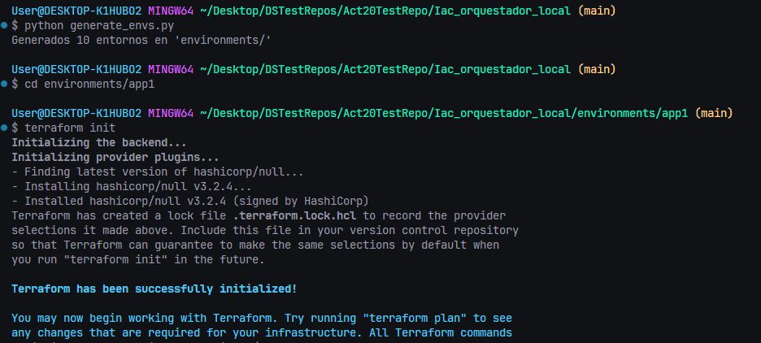
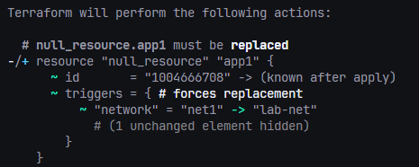
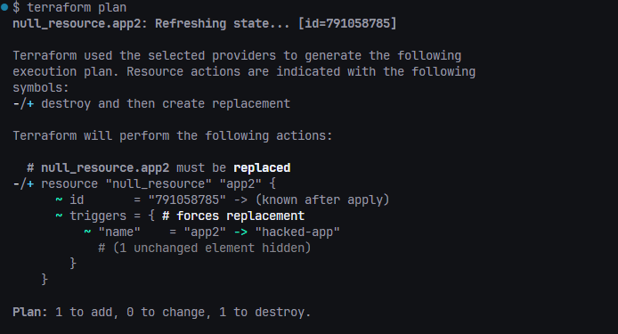
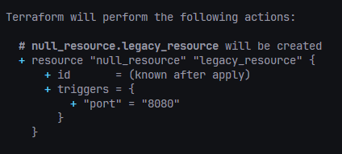
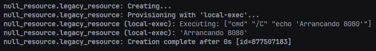

### Actividad: Escribiendo infraestructura como código en un entorno local con Terraform

####  Contexto

Imagina que gestionas docenas de entornos de desarrollo locales para distintos proyectos (app1, app2, ...). En lugar de crear y parchear manualmente cada carpeta, construirás un generador en Python que produce automáticamente:

* **`network.tf.json`** (variables y descripciones)
* **`main.tf.json`** (recursos que usan esas variables)

Después verás cómo Terraform identifica cambios, remedia desvíos manuales y permite migrar configuraciones legacy a código. Todo sin depender de proveedores en la nube, Docker o APIs externas.


#### Fase 0: Preparación 

1. **Revisa** el [proyecto de la actividad](https://github.com/kapumota/DS/tree/main/2025-1/Iac_orquestador_local)  :

   ```
   modules/simulated_app/
     ├─ network.tf.json
     └─ main.tf.json
   generate_envs.py
   ```
2. **Verifica** que puedes ejecutar:

   ```bash
   python generate_envs.py
   cd environments/app1
   terraform init
   ```

    

3. **Objetivo**: conocer la plantilla base y el generador en Python.

####  Fase 1: Expresando el cambio de infraestructura

* **Concepto**
Cuando cambian variables de configuración, Terraform los mapea a **triggers** que, a su vez, reconcilian el estado (variables ->triggers ->recursos).

* **Actividad**

  - Modifica en `modules/simulated_app/network.tf.json` el `default` de `"network"` a `"lab-net"`.

    ```json
    {
        "variable": [
            // ...
                "network": [
                    {
                        "type": "string",
                        "default": "lab-net",
                        "description": "Nombre de la red local"
                    }
                ]
            // ...
        ]
    }
    ```

  - Regenera `environments/app1` con `python generate_envs.py`.
  
    **En `generate_envs.py`**:

    *Se reemplazan las variables de ejemplo para tener en cuenta las que se definen en `modules/simulated_app/network.tf.json`*

    ```python
    config = {
        "resource": [
            {
                "null_resource": [
                    {
                        env["name"]: [
                            {
                                "triggers": {
                                    "name":    env["name"],
                                    "network": "${var.network}"
                                },
                                "provisioner": [
                                    {
                                        "local-exec": {
                                            "command": (
                                                f"echo 'Arrancando servidor {env['name']}"
                                                " en red ${var.network}'"
                                            )
                                        }
                                    }
                                ]
                            }
                        ]
                    }
                ]
            }
        ]
    }

    ```
    *Se comentan las siguientes lineas para no sobreescribir los entornos y, en consecuencia, borrar la inicialización y aplicacion previas de terraform.*

    ```python
    if __name__ == "__main__":
        """
        # Limpia entornos viejos (si quieres)
        if os.path.isdir(OUT_DIR):
            import shutil
            shutil.rmtree(OUT_DIR)
        """

        for env in ENVS:
            render_and_write(env)
        print(f"Generados {len(ENVS)} entornos en '{OUT_DIR}/'")

    ```

  - `terraform plan` observa que **solo** cambia el trigger en `null_resource`.

      

* **Pregunta**

  * ¿Cómo interpreta Terraform el cambio de variable?

      *Terraform puede interpretar el cambio de una variable como un cambio en el estado, en una característica, o un valor que determina la acción a tomar relacionado a la infraestructura, ya que, de estas, dependen los recursos definidos en los archivos de terraform. Por ejemplo, en este caso, las variables son las que definen el trigger, es decir, determinan si el recurso de la infraestructura se va a reconstruir o no.*

  * ¿Qué diferencia hay entre modificar el JSON vs. parchear directamente el recurso?

    *En este caso, no hay una diferencia abismal, en cuanto a tiempo, entre los dos. Sin embargo, si tuvieramos muchos recursos que modificar, mediante un programa en python y modificando plantillas, tomaría menos tiempo.*

  * ¿Por qué Terraform no recrea todo el recurso, sino que aplica el cambio "in-place"?

      *El cambio "in-place" implica solo actualizar el recurso y no destruirlo y volverlo a crear. Esto es más eficiente ya que evitamos construir un recurso que puede tardar en hacerlo, además, con esto, no perdemos el estado que se tenía previamente, lo que si sucede con la destruccion de recursos.*

  * ¿Qué pasa si editas directamente `main.tf.json` en lugar de la plantilla de variables?

      *Da el mismo resultado, para este caso, pero como se mencionó previamente, es más eficiente hacerlo desde un script automatizado.*

#### Fase 2: Entendiendo la inmutabilidad

#### A. Remediación de 'drift' (out-of-band changes)

1. **Simulación**

   ```bash
   cd environments/app2
   # edita manualmente main.tf.json: cambiar "name":"app2" ->"hacked-app"
   ```
2. Ejecuta:

   ```bash
   terraform plan
   ```
   Verás un plan que propone **revertir** ese cambio.

   

   *No se proporciona un plan que pretende revertir el cambio debido a que, al modificar el archivo de configuración, no estamos simulando un drift real. Para simularlo, debemos modificar una infraestructura gestionada por Terraform, pero fuera de él. Por ejemplo, si modificamos el nombre de un bucket de AWS luego de haber realizado `terraform apply`, terraform detectará el drift al ejecutar `terraform plan` y propondrá corregirlo para que coincida con la configuración. En ningún momento este último cambia.*

#### B. Migrando a IaC

* **Mini-reto**
 1. Crea en un nuevo directorio `legacy/` un simple `run.sh` + `config.cfg` con parámetros (p.ej. puerto, ruta).

    ```
     echo 'PORT=8080' > legacy/config.cfg
     echo '#!/bin/bash' > legacy/run.sh
     echo 'echo "Arrancando $PORT"' >> legacy/run.sh
     chmod +x legacy/run.sh
     ```
  2. Escribe un script Python que:

     * Lea `config.cfg` y `run.sh`.
     * Genere **automáticamente** un par `network.tf.json` + `main.tf.json` equivalente.

         *Ver el archivo `legacy.py`*

     * Verifique con `terraform plan` que el resultado es igual al script legacy.

         
         *Cuando realizamos el `terraform apply`, podemos ver que se imprime "Arrancando 8080", lo mismo que hace el script `run.sh`*
         


#### Fase 3: Escribiendo código limpio en IaC 

| Conceptos                       | Ejercicio rápido                                                                                               |
| ------------------------------------------ | -------------------------------------------------------------------------------------------------------------- |
| **Control de versiones comunica contexto** | - Haz 2 commits: uno que cambie `default` de `name`; otro que cambie `description`. Revisar mensajes claros. |
| **Linting y formateo**                     | - Instala `jq`. Ejecutar `jq . network.tf.json > tmp && mv tmp network.tf.json`. ¿Qué cambió?                 |
| **Nomenclatura de recursos**               | - Renombra en `main.tf.json` el recurso `null_resource` a `local_server`. Ajustar generador Python.           |
| **Variables y constantes**                 | - Añade variable `port` en `network.tf.json` y usarla en el `command`. Regenerar entorno.                     |
| **Parametrizar dependencias**              | - Genera `env3` de modo que su `network` dependa de `env2` (p.ej. `net2-peered`). Implementarlo en Python.    |
| **Mantener en secreto**                    | - Marca `api_key` como **sensitive** en el JSON y leerla desde `os.environ`, sin volcarla en disco.           |

#### Fase 4: Integración final y discusión

1. **Recorrido** por:

   * Detección de drift (*remediation*).
   * Migración de legacy.
   * Estructura limpia, módulos, variables sensibles.
2. **Preguntas abiertas**:

   * ¿Cómo extenderías este patrón para 50 módulos y 100 entornos?
   * ¿Qué prácticas de revisión de código aplicarías a los `.tf.json`?
   * ¿Cómo gestionarías secretos en producción (sin Vault)?
   * ¿Qué workflows de revisión aplicarías a los JSON generados?


#### Ejercicios

1. **Drift avanzado**

   * Crea un recurso "load\_balancer" que dependa de dos `local_server`. Simula drift en uno de ellos y observa el plan.

2. **CLI Interactiva**

   * Refactoriza `generate_envs.py` con `click` para aceptar:

     ```bash
     python generate_envs.py --count 3 --prefix staging --port 3000
     ```

3. **Validación de Esquema JSON**

   * Diseña un JSON Schema que valide la estructura de ambos TF files.
   * Lanza la validación antes de escribir cada archivo en Python.

4. **GitOps Local**

   * Implementa un script que, al detectar cambios en `modules/simulated_app/`, regenere **todas** las carpetas bajo `environments/`.
   * Añade un hook de pre-commit que ejecute `jq --check` sobre los JSON.

5. **Compartición segura de secretos**

   * Diseña un mini-workflow donde `api_key` se lee de `~/.config/secure.json` (no versionado) y documenta cómo el equipo la distribuye sin comprometer seguridad.